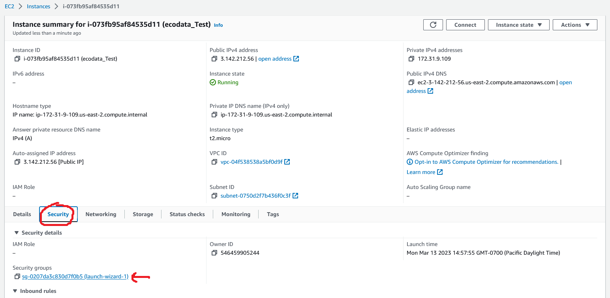
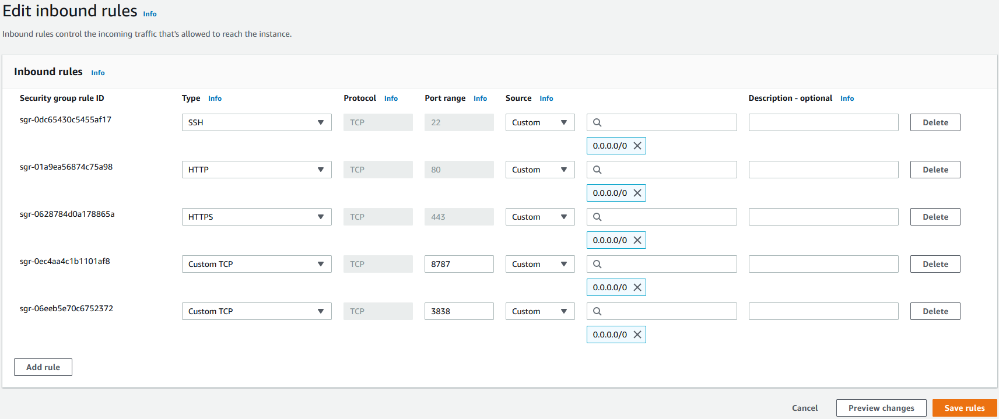
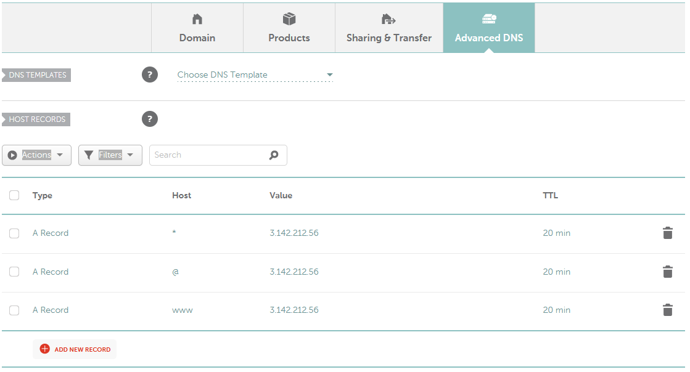
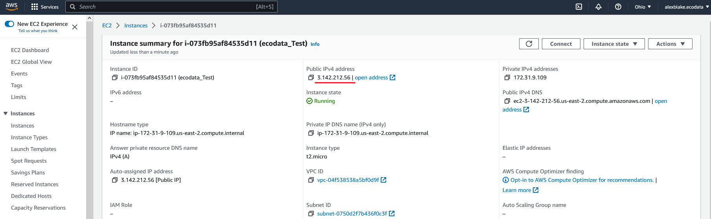

# R on AWS
Hosting R content (notably Shiny) on an AWS instance. Initially used to host the phenoGAM model for a Hugo marketing page (at https://ecodata.pro/phenogamTest/ and https://ecodata-shiny-demo.netlify.app/ respectively, also see the [Hugo page repo](https://github.com/ecodata-technology/see_three_POs/tree/main/Websites/Shiny%20Demo)).

## Summary of the tech stack
AWS was chosen over Google GCP and Microsoft Azure as it appeared better documented and battle-tested by other R users. Within AWS, an EC2 (Elastic Compute Cloud) t2.micro instance running Ubuntu 22 was used. EC2 can readily scale to meet computing needs, and t2.micro is free-tier eligible. Ubuntu 22 is the most recent stable release of Ubuntu, but in future it may be advisable to use version 20 instead for better compatibility with R libraries and their dependencies.

PuTTY was used as an SSH client on Windows to access the Ubuntu server terminal. Shiny Server was used to host the Shiny app on a .pro domain name, Nginx was used as a reverse proxy to substitute app port numbers with human-readable URLs, and Certbot was used to self-sign an SSL certificate so the app could be served over https (required to embed elsewhere, like on a Netlify website).

## Tutorials and other key resources
A [video tutorial by Tan Ho](https://www.youtube.com/watch?v=JL4T0qfqY7k) and [accompanying documentation](https://github.com/tanho63/tantorials/tree/main/20211011_shinyserver) walk through most of the process. Tutorials by [Charles Bordet](https://www.charlesbordet.com/en/guide-shiny-aws/) and [Dean Attali](https://deanattali.com/2015/05/09/setup-rstudio-shiny-server-digital-ocean/) were also useful.

The easiest way to reproduce is to follow the video tutorial. Below is a summary of the steps to take as well as specific problems and solutions for the PhenoGAM model.

# Key steps in setting up and running R on AWS for hosting content on Netlify

The following are required:
1. Create an EC2 t2.micro instance running Ubuntu
2. Set up port forwarding
3. Access the VM with SSH, add swap space
4. Install R, R packages, and Ubuntu dependencies
5. Install Shiny Server and RStudio Server
6. Deploy app on server
7. Buy and set up a domain
8. Set up reverse proxy (Nginx) and HTTPS (Certbot)
9. Embed apps on Netlify

### 1. Create the instance

From the AWS management dashboard, choose to `Launch a virtual machine with EC2` under the `Build a solution` widget.

- `Application and OS Images:` choose `Quick Start` with a 'Free tier eligible' Ubuntu AMI. I used Ubuntu 22.04, but 20.04 might be worth trying in future for easier installation of R dependencies. Set 64-bit x86 architecture.
- `Instance type:` choose 'Free tier eligible' t2.micro instance type.
- `Key pair (login):` create a key pair, give it a name, select RSA for type and .ppk for file format (if you'll be accessing on Windows via PuTTY).
- `Network settings:` create security group that allows SSH traffic from Anywhere (or specify your ip address).
- `Configure storage:` bump up to 30 GiB (maximum allowed on free tier).

Then `Launch instance`.

### 2. Port forwarding

From the EC2 dashboard, open the `Security` tab and click on the security group.

Under `Inbound rules` click `Edit inbound rules`. You need to open up HTTP, HTTPS, and Custom TCP on ports 8787 (Rstudio) and 3838 (Shiny Server), replicating the rules below:

Set `Source` to `Anywhere-IPv4`, the rest should auto-fill.

### 3. Access the VM, add swap space

If using Windows, you need the PuTTY client to connect to the Ubuntu server over SSH. Read [Section 3 of Charles Bordet's tutorial](https://www.charlesbordet.com/en/guide-shiny-aws/#how-to-access-your-new-server) for configuring PuTTY.

Default credentials to log in to the Ubuntu server are `user: ubuntu` and `password: ubuntu` (you may not be prompted for a password).

Before proceeding, add swap space as per [Section 6 of Dean Attali's tutorial](https://deanattali.com/2015/05/09/setup-rstudio-shiny-server-digital-ocean/#install-r) to ensure sufficient memory when installing R libraries. An extra 2 gb was added to the phenoGAM server swap space.

### 4. Install R, R packages, and Ubuntu dependencies

Install R using the [official instructions](https://cran.rstudio.com/bin/linux/ubuntu/). Make sure you install both r-base **and r-base-dev**.

Open R with `sudo R`. Begin with `install.packages("pak", repos = "https://r-lib.github.io/p/pak/dev/"), installing other packages using pak will make it easier to work through dependencies. Iterate with pak::pak(c("<package1>",...,"<package n>")) to work through packages e.g. Shiny and catch any system dependencies (these will require quitting R to install back in the Ubuntu terminal).

For the phenogamShiny app:
- Several R dependencies have system dependencies. They won't install without first installing the system dependencies.
- Respectively, these are: `libcurl4-openssl-dev`, `libssl-dev`, `libxml2-dev`, `libgdal-dev`, `libudunits2-dev`, and `libfreetype6-dev`.
- Install them from the Ubuntu terminal with `sudo apt-get install <dependency>`, substituting the libraries above into `<dependency>`.
- Then you can install the R dependencies with `pak::pak(c("shiny","golem","shinyBS","shinyjs","xml2","curl","ncdf4","terra","units","s2","openssl","raster","sf","gridtext","httr","rinat","ggtext","leaflet","daymetr","showtext","sysfonts"))`.
- Finally install the phenoGAM app with `remotes::install_github("https://github.com/ecodata-technology/phenogamShiny")`.

### 5. Install Shiny Server and RStudio Server

For Shiny Server, follow [the official instructions](https://www.rstudio.com/products/shiny/download-server/ubuntu/). Do the same for [RStudio Server](https://www.rstudio.com/products/rstudio/download-server/debian-ubuntu/) **but** you will need to install the [daily build](https://dailies.rstudio.com/rstudio/cherry-blossom/server/jammy-amd64/) rather than the latest stable build, which is not yet compatible with Ubuntu 22.

### 6. Deploy app on the server

`sudo git clone <repo URL> into /srv/shiny-server. Tan Ho's tutorial instructs you to store apps elsewhere for tidiness and then create a pointer to this directory to make them accessible to Shiny Server. However this runs into permissions issues on Ubuntu 22.

Since the phenoGAM app was built using golem, we need to take one extra step to prepare the files for Shiny Server. Navigate to `/srv/shiny-server/<repo name>/inst/` and open R. Then execute: `golem::add_shinyserver_file()`.

At this point the app should be accessible at http://<instance public IPv4 address>:3838/<app repo name>

### 7. Buy and set up a domain

For the phenoGAM app we used ecodata.pro with Namecheap.

Navigate to advanced DNS settings and set up the following three 'a' records:

The IP address in the `value` field is the public IPv4 address from the AWS instance (visible in the Instance summary):

### 8. Set up reverse proxy and HTTPS

For Nginx, refer to [Section 5.3 of Charles Bordet's tutorial](https://www.charlesbordet.com/en/guide-shiny-aws/#3-set-up-a-reverse-proxy-with-nginx).

For Certbot, enter `Nginx` in the `Software` field and `Ubuntu 20` in the `System` field on [the official website](https://certbot.eff.org/) and follow the instructions it provides.

When you get to part 7, follow the instructions to `get and install your certificates`.

### 9. Embed on Netlify

Embed in any markdown or HTML page with an iframe:

`<iframe height="1200px" width="100%" src="https://ecodata.pro/phenogamTest/" frameborder="0"></iframe>`

The app **must** be served through https. A major limitation of iframes is that the height of the frame is fixed, and won't adjust dynamically to the size of the content it displays. So apps should be developed with a fixed height where possible if the intention is to embed them in a webpage.

This limitation can be overcome using javascript, but this isn't an option on static pages like those hosted on Netlify.

# Appendix

## Handy linux commands

- Preface commands with `sudo` to execute with admin level permission.
- `ctrl-insert` is copy, `shift-insert` is paste.
- `cd` to change directory, `ls -la` to list directory contents.

## CSS for phenoGAM app

- Create CSS style file and external pointers with `golem::add_css_file("stylescss")
- Colours, fonts, and collapse-panel locking are specified in `inst/app/www/stylescss.css`
- Import Ecodata Google fonts with the following on line 1: `@import url('https://fonts.googleapis.com/css2?family=Lexend+Deca&family=Roboto+Condensed&display=swap');`
- Lock the shinyBS collapsable panels open with the style: `.panel-title{pointer-events: none;}`.
