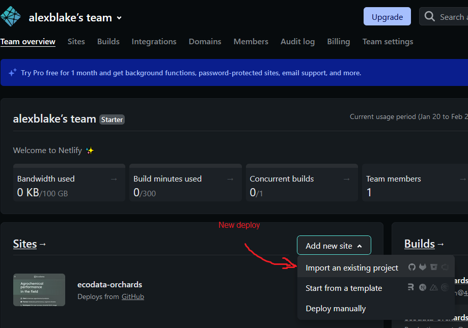
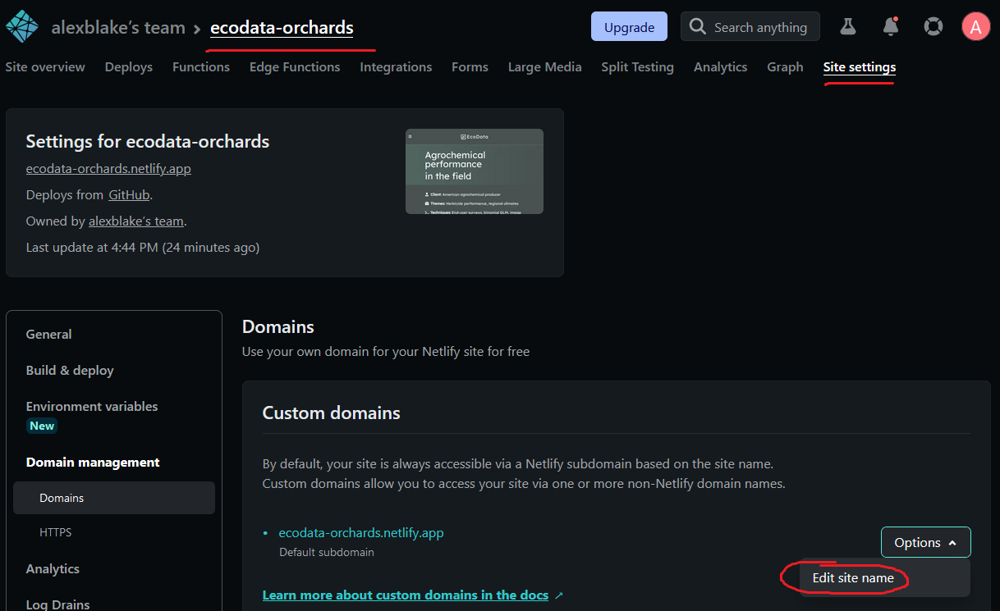
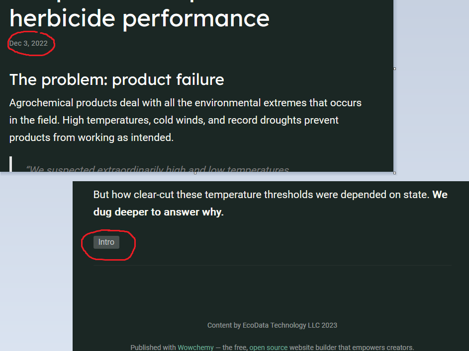

# Ecodata marketing pages
Web-based technical reports showcasing skill uses in three prior contracts.

Built using Hugo and the Wowchemy theme toolkit, deployed on Netlify. Hugo was preferred over Jekyll for the engine due to Blogdown (R) integration and better Windows integration. Wowchemy provided a really flexible theme framework that looks slick and has a highly responsive team on Discord. Netlify was preferred over Github Sites as the latter has pedantic directory structure requirements. It's still free to use and integrates cleanly with Github repos and continuous site deployment.

#### Three planned pages
Showcase 1: Using weather databases to evaluate agrochemical product performance using surveys

Showcase 2: Simulating economic and ecological outcomes in diversified, perennial cropping systems

Showcase 3: Crowd sourced data for modeling spongey moth and invasive species.

## Support
Use the [Wowchemy docs](https://wowchemy.com/docs/) for changes to the theme. It'll let you know if and when you need to fiddle with the underlying Hugo code or use custom HTML and CSS. The marketing pages are built with V2. If you get stuck, the team on the [Wowchemy Discord](https://discord.gg/z8wNYzb) are super responsive, generally answering within an hour.

The [Blogdown docs](https://bookdown.org/yihui/blogdown/) step through Netlify deployment.

# How to use and reuse the pages

## Directory structure
Marketing pages (`Agrochemicals` and `Mars`) are stored in their own folders inside `Websites`. These are self-contained, including our marketing content as well as the Wowchemy/Hugo theme code.

### Anatomy of the Hugo-Wowchemy pages
Focusing only on the key files and folders to edit the content or make a new marketing page. Tweaking some parts of the theme itself requires obscure files tucked away in odd places. Those are addressed in the Appendix.

Using Agrochemicals as an example, key files are flagged with an asterisk (*).

```
.
└── Agrochemicals/
    ├── assets/
    │   └── media/
    │       └── bg.jpeg
    ├── config/
    │   └── default/
    │       ├── config.yaml *
    │       ├── menus.yaml *
    │       └── params.yaml
    ├── content/
    │   ├── _index.md *
    │   ├── authors/
    │   └── project/
    │       ├── one/
    │       │   ├── index.Rmd *
    │       │   ├── index.md
    │       │   └── featured.jpg *
    │       ├── two/
    │       │   ├── index.Rmd *
    │       │   ├── index.md
    │       │   └── featured.jpg *
    │       └── three/
    │           ├── index.Rmd *
    │       │   ├── index.md
    │       │   └── featured.jpg *
    ├── data/
    ├── layouts/
    ├── R/
    ├── resources/
    └── themes/
```

## Editing content
Once a site is deployed, all you have to do is Push and Netlify will automatically rebuild live site with new content.

The key pieces of content for most editing jobs are:
1. The sub-pages
2. Landing page summaries of the sub-pages
3. Landing page title and project overview
4. Landing page footer image with parallax
5. Nav-bar item names

#### 1. Sub-page content
Sub-page content is fully self-contained within their own folders (`one`, `two`, `three`). These correspond to the first, second, and third landing-page summaries. Using sub-page one as an example:

- Open `/content/project/one/index.Rmd`
- Change the title in the YAML header
- Change all other content as regular R Markdown below the YAML head, I've kept all images, data etc self-contained within the relevant sub-page folder.
- Knit a new `index.md` (the website relies on .md files, not .Rmd).

#### 2. Landing page summaries
These are contained within the sub-page YAML headers. E.g. to change the landing page summary of sub-page one:

- Open `/content/project/one/index.Rmd`
- In the YAML header, change the text in the 'summary:' section
- The landing page heading is also pulled from the 'title:' section of the sub-page YAML header
- Change associated the picture showcased on the landing page by replacing `featured.jpg` in the project folder (.png is also ok, no other changes to the code required)

#### 3. Landing page title and project overview
The landing page is defined in one huge YAML header in `/content/_index.md`.

- Edit the headline title in the `title:` section (line 6) of the `Hero` block
- Edit the project summary (Client, Themes, Techniques) in the `text:` section (line 21) of the first `markdown` block


#### 4. Landing page footer image

Just replace `/assets/media/bg.jpeg`.

Other image types are ok but then you have to tweak the pointer to this image in `/content/_index.md`. Change the filename accordingly under the final markdown block (line 60).

#### 5. Nav-bar item names

These are specified in `/config/_default/menus.yaml`. Change names under the `name:` section corresponding to each page url (`/` is for the landing page).

## Making a new marketing page
Copy the whole folder for an existing marketing page and rename it.

RStudio may struggle with the volume of new files to stage and commit. If you try and it wigs out, do it from the Terminal pane instead of the Git pane: `git add -A` then `git commit -m "your message here".

If it already wigged out and now seems stuck, you probably need to remove the git lock first (again using the Terminal pane): `rm -f .git/index.lock`

Once set up you can edit content as above, then make a new deploy on Netlify.

#### Deploying sites






Finally, we need to update `/config/_default.config.yaml` with this new URL. Just paste it at `baseURL:` at the top of the file. Then commit and Push the updated config to the deployed site.

For more on Netlify deploys check out the [Blogdown docs section on deploying](https://bookdown.org/yihui/blogdown/netlify.html).

# Appendix

Other miscellaneous changes to the theme are generally well documented by Wowchemy. Anything that isn't is documented here.

Customizing any content contained in the markdown section of a .Rmd can just be done with CSS which is well-documented elsewhere.

#### Customizing the landing page
The landing page is [built with 'blocks'](https://wowchemy.com/blocks/) in a big YAML header. [This is well documented by Wowchemy](https://wowchemy.com/docs/content/landing-pages/), but important. The marketing pages are built with V2 blocks, not V1.

#### Custom colour theme
- Edit `data/themes/ecodata.toml`.
- The theme is activated by entering the name field from `ecodata.toml` as the argument for `theme_night:` under `#Appearance` in `params.yaml`.

#### Custom fonts
- Edit `data/fonts/ecodata.toml`.
- Use the [Wowchemy guide](https://wowchemy.com/docs/getting-started/customization/#custom-theme) to fetch a font family from Google fonts (like I did).
- The theme is activated by entering the name field from `ecodata.toml` as the argument for `font:` under `#Appearance` in `params.yaml`.

#### Custom CSS for non-markdown content (used for landing page title and text, and the nav-bar)
- Add new CSS styles in '/assets/scss/custom.scss' and name your class
- Invoke these styles with a `css_class:` argument under `design:` in the relevant `block` in the YAML header. See the `hero` block in `/content/_index.md` for an example.
- Override default CSS for the nav-bar with a `.navbar` class in `custom.scss`, e.g. changing the height of the bar or the font size.

#### Linkedin button in the nav-bar
- Change the icon, hover message, external link, or disable by editing `/content/authors/admin/_index.md`.

#### Ecodata nav-bar logo link to company site
- Change the hardcoded URLs in lines 22 & 43 of `/layouts/partials/components/headers/econavbar.html`.
- Activate the custom nav-bar by specifying it as a custom block under `# Site header` in `params.yaml` (currently set to `block: econavbar`).

#### Rounded edges on landing page showcase images, and more padding below them on mobile view
- Styling content in markdown is easy using CSS, but the images on the landing page are fetched from underlying Hugo code.
- Rounded edges and padding on the showcased `featured.jpg` images are defined in a custom block at `/layouts/partials/views/community/showcase_rounded.html`
- Tweak the values for `border-radius:` and `padding:` to change them. Padding makes the mobile version look better.
- In `content/_index.md`, activate the custom block by specifying it as the argument for `view:` (line 52) in the `portfolio` block (currently set to `view: community/showcase_rounded`).

#### Removing dates and tags from sub-pages
- `page_footer.html` and `page_metadata.html` in `/layouts/partials/` override the default copies of these files that added dates and tags to sub-pages.
- Just delete or rename them to restore the default behaviour.


