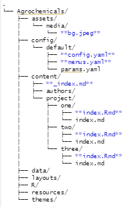
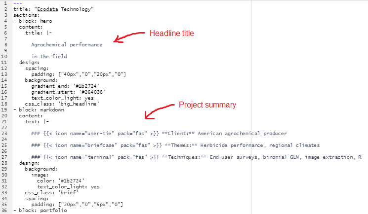

# Ecodata marketing pages
Built using Hugo and the Wowchemy v2 theme toolkit, deployed on Netlify. Hugo was preferred over Jekyll for the engine due to Blogdown (R) integration and better Windows integration. Wowchemy provided a really flexible theme framework that looks slick and has a highly responsive team on Discord. Netlify was preferred over Github Sites as the latter has pedantic directory structure requirements. It's still free to use and integrates cleanly with Github repos and continuous site deployment.

## Support
Use the [Wowchemy docs](https://wowchemy.com/docs/) for changes to the theme. It'll let you know if and when you need to fiddle with the underlying Hugo code or use custom HTML and CSS. The marketing pages are built with V2. If you get stuck, the team on the [Wowchemy Discord](https://discord.gg/z8wNYzb) are super responsive, generally answering within an hour.

The [Blogdown docs](https://bookdown.org/yihui/blogdown/) step through Netlify deployment.

# How to use and reuse the pages

## Directory structure
Marketing pages ('Agrochemicals' and 'Mars') are stored in their own folders inside 'Websites'. These are self-contained, including our marketing content as well as the Wowchemy/Hugo theme code.

### Anatomy of the Hugo-Wowchemy pages
Focusing only on the key files and folders to edit the content or make a new marketing page. Tweaking some parts of the theme itself requires obscure files tucked away in odd places. Those are addressed in the Appendix.

Using Agrochemicals as an example, key files are highlighted in **bold**:

## Editing content
The key pieces of content for most editing jobs are:
1. The sub-pages
2. Landing page summaries of the sub-pages
3. Landing page title and project overview
4. Landing page footer image with parallax
5. Nav-bar item names

### 1. Sub-page content
Sub-page content is fully self-contained within their own folders ('one', 'two', 'three'). These correspond to the first, second, and third landing-page summaries. Using sub-page one as an example:

- Open /one/index.Rmd
- Change the title in the YAML header
- Change all other content as regular R Markdown below the YAML head, I've kept all images, data etc self-contained within the relevant sub-page folder.
- Knit a new index.md (the website relies on .md files, not .Rmd).

### 2. Landing page summaries
These are contained within the sub-page YAML headers. E.g. to change the landing page summary of sub-page one:

- Open /one/index/Rmd
- In the YAML header, change the text in the 'summary:' section
- The landing page heading is also pulled from the 'title:' section of the sub-page YAML header

### 3. Landing page title and project overview
The landing page is defined in one huge YAML header in /content/_index.md.

1. Edit the headline title in the 'title:' section (line 6) of the 'Hero' block.
2. Edit the project summary (Client, Themes, Techniques) in the 'text:' section (line 21) of the first 'markdown' block.

### 4. Landing page footer image

Just replace /assets/media/bg.jpeg.

Other image types are ok but then you have to tweak the pointer to this image in /content/_index.md. Change the filename accordingly under the final markdown block (line 60).

### 5. Nav-bar item names

These are specified in /config/_default/menus.yaml.

## Making a new marketing page
Copy the whole folder for an existing marketing page, rename it, and edit the content as above. Then make a new deploy.

## Making a new deploy
