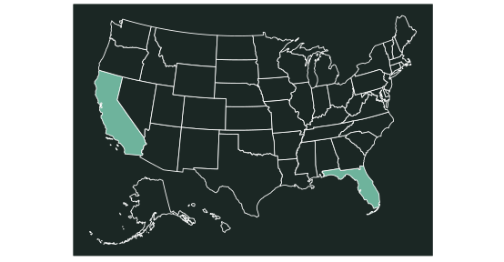

```{r setup, include=FALSE}
knitr::opts_chunk$set(echo = FALSE)
library(ggplot2)
library(tidyverse)
library(effects)
library(ecodatamisc)
demo_dat <- read.csv("demo.csv")
demo_dat$response = as.factor(demo_dat$Product_success)
dat2 = subset(demo_dat,State=="California")
dat3 = subset(demo_dat,State=="Florida")
bg = "#1b2724"
wh = "#ffffff"
pl = "#6eb39c"
```

<style>
p.caption {
  font-size: 0.8em;
  padding: 0px 0px 40px 0px;
}
qt {
  color:#cccccc;
}
</style>

## Uncovering hidden complexities

Our analyses confirmed the client’s initial hunch that temperature alone drove product failure. Going further, our data scientists also found that product performance was responding differently to temperature on the East Coast compared to the West.



Building on the client’s question like this added **valuable but tricky nuances** to our results.

## What is the answer?

Some analyses are easy to interpret – we can summarize them with simple bar graphs or time series. But as problems become more complex so do the analyses and their outputs.

> <qt>*"We felt the team at Ecodata really valued our time. They walked us through the specifics, but always brought things back to the key highlights. Results and implications of the analyses were clear... we never felt lost in the gritty details."*</qt>

One such analysis is the binomial GLM, a powerful tool for yes/no data like our client provided. But the outputs can be tricky to visualize, and tricker when different segments arise in the data such as geography.


**Our consultants worked closely with the client explain these outputs comprehensively, but clearly.**

## A case study: how we leverage simple yes/no surveys

A client has provided us with 104 growers reporting success or failure of a product - here we'll use some anonymized results. We’ve enriched the survey with additional environmental data performed a statistical analysis.

```{r bar, fig.cap="Simple bar chart showing the overall response from end-user survey on agrochemical success following product application. A plot like this gives a useful summary, but loses valuable detail."}
demo_dat %>%
  group_by(Product_success) %>%
  summarize(value = n()) %>%
  ggplot(aes(x = Product_success, y = value)) +
    geom_bar(stat = 'identity', fill = pl) +
    labs(title = '', x = '\nQuestion:\n\nWas the product effective?', y = 'Survey response count\n') +
    ylim(0,80) +
    theme_ecodata() +
    theme(
      panel.background = element_rect(fill=bg, colour=NA),
      plot.background = element_rect(fill=bg, colour=NA),
      axis.line = element_line(colour=wh),
      axis.text = element_text(colour=wh),
      axis.title.x = element_text(colour=wh),
      axis.title.y = element_text(colour=wh),
      panel.border = element_rect(colour=wh,fill=NA)
    )
```

It looks like warmer temperatures degrade agrochemical performance. **But how can we know for sure?** And when exactly is it too hot to use the product?

We can just count the number of 'yes' and 'no' responses. But **that doesn’t tell us how confident we are, or where the temperature cut-offs lie.**

## Solving the problem with binomial GLMs

When we visualize binomial GLMs, a steep S-shaped curve shows a strong correlation between product performance and temperature. A flatter curve is a weak correlation.

#### Results are clear on the West Coast

In California we see a steep S-curve, showing a strong correlation between high temperature and agrochemical performance.

```{r cali, fig.cap="Probability of agrochemical product success in response to daily maximum temperatures on farms in California. High temperatures significantly impacted product performance (p < 0.001)."}
mod2 = glm(response ~ Daily_high_temp, family=binomial, data=dat2)
eff2 = allEffects(se=TRUE, xlevels=100, mod=mod2) %>%
  as.data.frame()

ggplot(data=eff2$Daily_high_temp,aes(x=Daily_high_temp, y=fit))+
  geom_line(linewidth=1,colour=pl) +
  geom_ribbon(aes(ymin=fit-se, ymax=fit+se),alpha=.2,fill=pl) +
  geom_hline(yintercept=0.75,colour=wh,linetype="dashed") +
  scale_y_continuous(labels=scales::percent) +
  labs(title = '', x = '\nDaily max. temp. (F)\n\nCalifornia', y = 'Product success (%)\n') +
  theme_ecodata() +
  theme(
    panel.background = element_rect(fill=bg, colour=NA),
    plot.background = element_rect(fill=bg, colour=NA),
    axis.line = element_line(colour=wh),
    axis.text = element_text(colour=wh),
    axis.title.x = element_text(colour=wh),
    axis.title.y = element_text(colour=wh),
    panel.border = element_rect(colour=wh,fill=NA)
  ) +
  geom_point(data=dat2, aes(x=Daily_high_temp, y=as.double(response)-1), position=position_jitter(w=0.05, h=0), alpha=.3, colour=pl)
```

Reported product failures show up along the bottom of the plot (0%) and successes are at the top (100%), represented by dots at different temperatures.

```{r calibox, fig.cap="The product fell below the client's key performance rate of 75% (horizontal line) above 88F."}
mod2 = glm(response ~ Daily_high_temp, family=binomial, data=dat2)
eff2 = allEffects(se=TRUE, xlevels=100, mod=mod2) %>%
  as.data.frame()

ggplot(data=eff2$Daily_high_temp,aes(x=Daily_high_temp, y=fit))+
  geom_line(linewidth=1,colour=pl) +
  geom_ribbon(aes(ymin=fit-se, ymax=fit+se),alpha=.2,fill=pl) +
  scale_y_continuous(labels=scales::percent) +
  labs(title = '', x = '\nDaily max. temp. (F)\n\nCalifornia', y = 'Product success (%)\n') +
  theme_ecodata() +
  theme(
    panel.background = element_rect(fill=bg, colour=NA),
    plot.background = element_rect(fill=bg, colour=NA),
    axis.line = element_line(colour=wh),
    axis.text = element_text(colour=wh),
    axis.title.x = element_text(colour=wh),
    axis.title.y = element_text(colour=wh),
    panel.border = element_rect(colour=wh,fill=NA)
  ) +
  geom_point(data=dat2, aes(x=Daily_high_temp, y=as.double(response)-1), position=position_jitter(w=0.05, h=0), alpha=.3, colour=pl)  +
  geom_rect(aes(xmin = 75, xmax = 95, ymin = .25, ymax = .975), 
          fill = "NA", alpha = 0.4, color = wh, linewidth = 1)
```

This area is where we figure out what the thresholds are. The product begins to fail just under 80F, **when the shaded confidence ribbon drops below 100%.** By 88F the success rate dropped beneath the client's key performance threshold of 75%. Beyond 103F the product no longer worked at all.

#### More  questions from the East Coast

On the other hand, we’re much less confident about how temperature impacts the product for growers in Florida. Success is consistently around 75% at all temperatures, which is great! But why? **Good analyses can create more questions and lead us to a complete understanding of how a product works in the field.**

```{r fl, fig.cap="Probability of agrochemical product success in response to daily maximum temperatures on farms in Florida only (p = 0.82)."}
mod3 = glm(response ~ Daily_high_temp, family=binomial, data=dat3)
eff3 = allEffects(se=TRUE, xlevels=100, mod=mod3) %>%
  as.data.frame()

ggplot(data=eff3$Daily_high_temp,aes(x=Daily_high_temp, y=fit))+
  geom_line(linewidth=1,colour=pl) +
  geom_ribbon(aes(ymin=fit-se, ymax=fit+se),alpha=.2,fill=pl) +
  scale_y_continuous(labels=scales::percent) +
  labs(title = '', x = '\nDaily max. temp. (F)\n\nFlorida', y = 'Product success (%)\n') +
  theme_ecodata() +
  theme(
    panel.background = element_rect(fill=bg, colour=NA),
    plot.background = element_rect(fill=bg, colour=NA),
    axis.line = element_line(colour=wh),
    axis.text = element_text(colour=wh),
    axis.title.x = element_text(colour=wh),
    axis.title.y = element_text(colour=wh),
    panel.border = element_rect(colour=wh,fill=NA)
  ) +
  geom_point(data=dat3, aes(x=Daily_high_temp, y=as.double(response)-1), position=position_jitter(w=0.05, h=0), alpha=.3, colour=pl)
```

#### Working with uncertainty

The p-value summarizes how confident we are in the model conclusions, or the risk that our model is *wrong*. This kind of uncertainty is helpful: **clients can use model uncertainty to make informed business decisions by placing a dollar value on risk.**


In California, a p-value under 0.001 says we’re very confident that spraying at high temperatures would just be a waste - **there's only a 0.1% chance our conclusion is wrong.** Growers can estimate the cost of *not* spraying (e.g. pest damage), adjust for the chance our model is wrong (0.1%), and compare to the savings made by not (wastefully) spraying.

By contrast, in the Florida model we have a p-value of 0.82. So there’s a 82% risk that higher temperatures *don’t* affect the product. In other words, **advising end-users to save their herbicide at high temperatures might lead to pest damage that could’ve been avoided.**

## Distilling things down to actionable insights


Here we'd advise our client to give strong guidance to citrus growers in California. But for end-users in Florida, their advice should be transparent but qualified.

> <qt>*"The take-home was simple: don't waste our herbicide above 88F. Clear advice for West Coast orchards made it easy for us to ensure customer satisfaction. We wanted to provide the same kind of clear guidance to our customers in the East, so we asked Ecodata to drill further into the Florida data."*</qt>