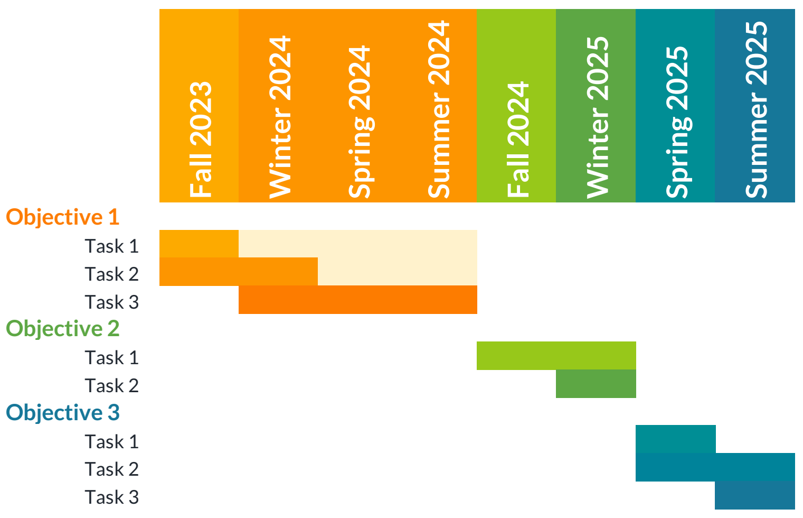

## Motivation

Problems with the risk-based survey.

## Involving all stakeholders

Stress we'll be consultative.

# How our solution works

Overview, high level design.

## Header 1

Details

## Header 2

<!-- Have to use html tags rather than markdown to get the coloured box panels to look right. Copy them or just let me know which bits you'd like in boxes and I'll do it tomorrow. -->

<h2 style="color: #ffffff"> Inset box </h2>

Here's an example of the timeline.

