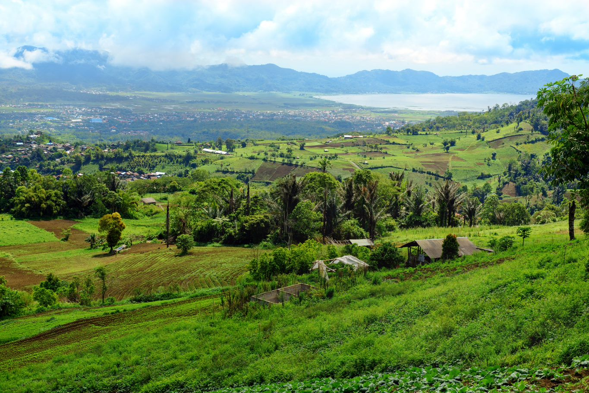
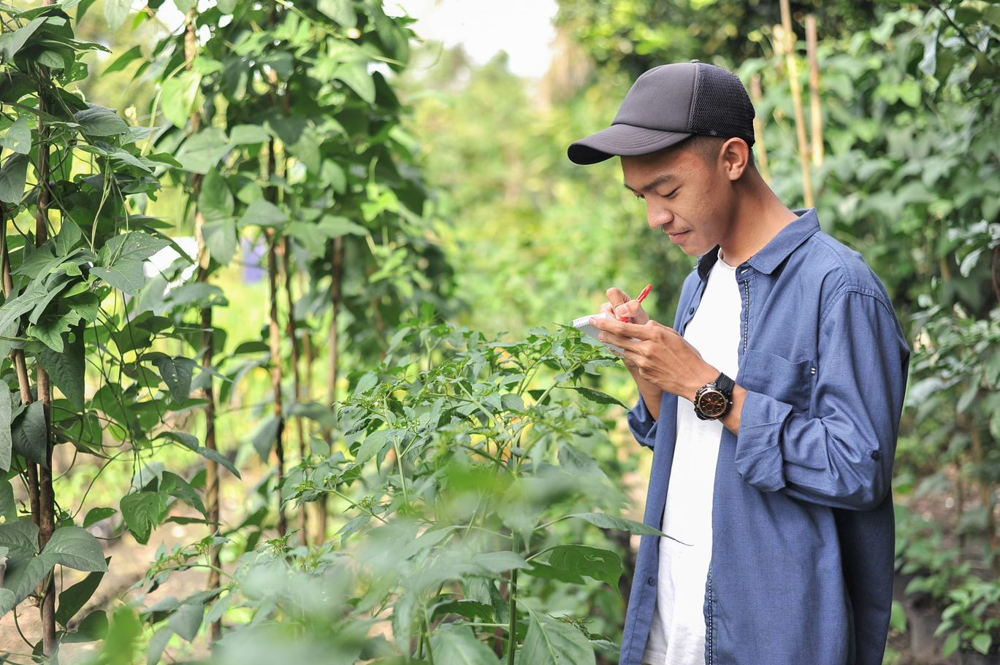
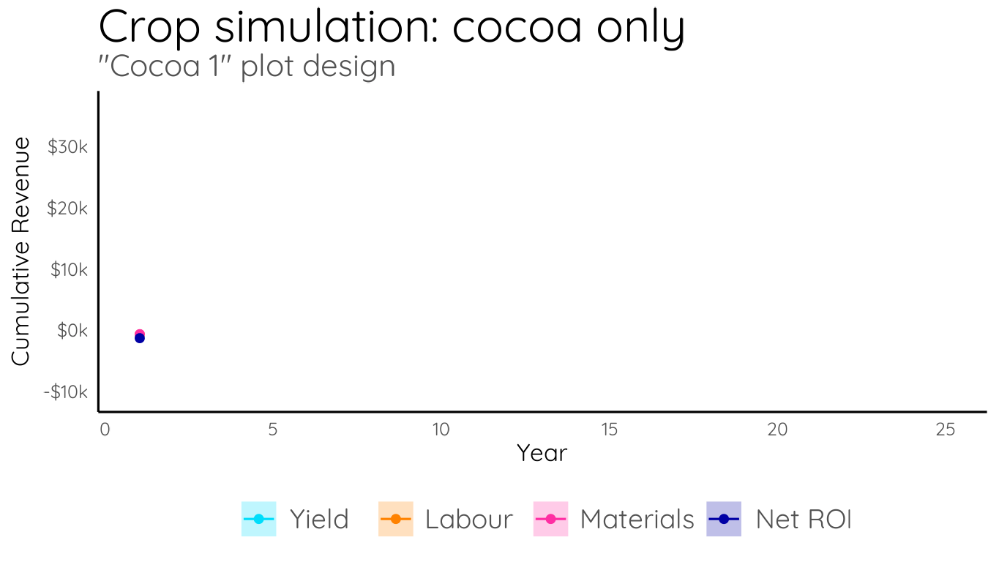
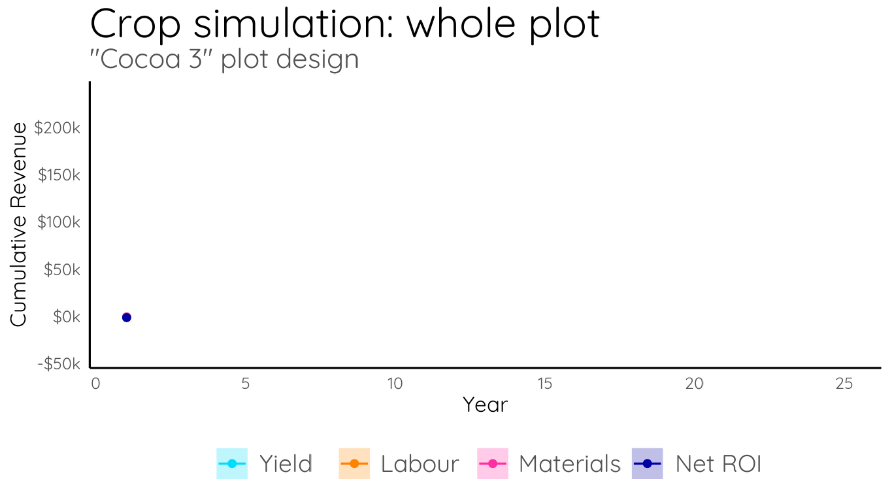
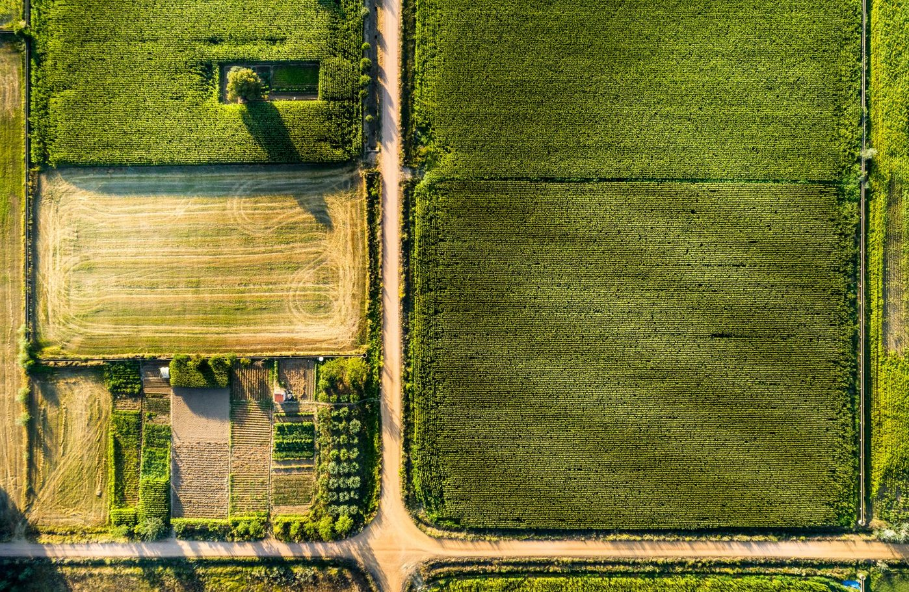

## Motivation

Increaing the diversity of crops in cacao agroforestry systems can benefit both farmers and the environment. The Farm System Diversification Program has been working with Ecodata Technology to quantify the economic and ecological outcomes of new farm designs in Indonesian cacao farms.

## Data collection takes time

Perennial crops like cacao, coconut, and mango take years to hit their first yield. Cocoa trees fruit for 30 years, meaning most farm designs have a life cycle longer than most research programs. Using a combination of high-quality farm data and computer simulations, we are working on long-range forecasts to compare different farm scenarios.

## Using forecasts to help

<!-- The webm version loses the pause at the end, so I've retained gifs for the timelapse animations. Just uncomment to revert to the webms. -->

<!-- <video autoplay loop style="width:100%" controls src="cocoa_sim.webm"></video> -->

Using a combination of statistics and computer science skills, we can forecast the range of economic outcomes expected under different agroforestry designs. The data "pipeline" underlying this project is highly flexible: the simulation will change based on updated econonmic data and we can ask for forecasts from an unlimited number of agroforestry layouts.

## Building 'what if?' scenarios

The approach isn't all too complicated. Using a known range of values for yields, labor costs, and materials costs, we make monthly projections for costs and returns. Once we see an "what if?" scenario, we can see if the returns are worth investing in real-world field trials or not.

# How the simulation works

<!-- The webm version loses the pause at the end, so I've retained gifs for the two timelapse animations. Just uncomment to revert to the webms. -->

<!-- <video autoplay loop style="width:100%" controls src="facet_time.webm"></video> -->

In each farm simulation, all crops are simulated independently. Up to a dozen crops can be included, and at the tail-end of the simulations, each crop's return is aggregated to make forecasts for a farm over 30 years.

## Input data were curated

First, data for each crop were collected from our farms in Sulawesi, provided by the Sustainable Solutions team. Ecodata developed a data cleaning pipeline to standardize these parameters and validate against external data sources.

## Economic inputs were varied

<video autoplay loop style="width:100%" controls src="inputs.webm"></video>

Labor and materials costs were unique for each crop, extending across multiple different time-scales - some crops live for over 30 years, others for only a few months. Some crops never produce fruit, and are instead timber species that are thinned only every 10 years!

<!-- Have to use html tags rather than markdown to get the coloured box panels to look right. Copy them or just let me know which bits you'd like in boxes and I'll do it tomorrow. -->

<h2 style="color: #0000A5"> So were crop life histories </h2>

The flexible pipeline developed by EcoData can simulate continuous harvesting and single-event harvesting, like timber or annual crops like corn.

<h2 style="color: #0000A5"> Growing and harvesting were simulated on a monthly basis </h2>

Monthly time-steps capture seasonal variation in crop performance and enable us to compare long-lived and short-lived crops.

## Simple business metrics

Predicted harvests are summarized in dollar terms, accounting for factors such as inflation and fluctuating exchange rates.

<video autoplay loop style="width:100%" controls src="output_dots.webm"></video>

# Powering new business questions

We've seen that one farm simulation only opens more questions! The project now is working towards a key question eluding researchers for some time: what is the 'ideal' cropping system given current economic conditions? The answer to that question is part of an ongoing collaboration.

## Getting granular

For the Sustainable Solutions team to evaluate results of the simulation, forecasts are presented in dashboard-style. Simulation results are separated in each trial, with options to slice through the results. For example, materials costs or timber harvests can be excluded on the fly to assess how yields, expenses, and revenues could evolve month-on-month if major changes to activites are enacted.

## Custom plot designs

The simulation process was built to be flexible and incorporate regular feedback from scientists and farmers alike. We can easily provide the specifications for new plot designs to feed into the model. To date we've investigated over 150 different farm designs, integrating up to 30 different crops.

## The bottom line

With these tools we've been able to explore the potential opportunities and risks when adopting new crop varieties, rotations, and intercropping strategies before ever planting a new seed in the ground.

